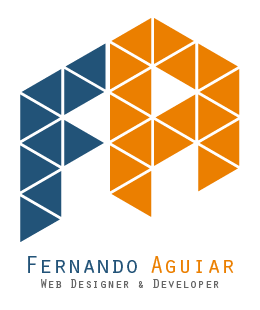

# Portfolio Project

## Quick Note

This repository is composed of various works that I have realized throughout my time studying Web Design and Development. Within this repo you will find the most impactful projects that have furthered my experience and expanded my knowledge in this industry. Throughout these works you will find both code snippets, concepts, practice code, video summary links, additional guides, and even personal notes.

The final purpose of this project is to better display my experience and knowledge gained throughout my time as a student. Each section will have meaningful instructions on how to utilize them and guide you through my portfolio repository. Thanks for taking the time to view this repo, I hope that you enjoy the work.

## Table of Contents

- [Stacker Game](./Stacker_Game/) - Fully functional Arcade Stacker made using Arduino and components.
- [Javascript Duel](./Javascript_Duel/) - Simple Duel game based on luck using vanilla javascript.
- [Agile Development Overview](./Agile_Development_Overview/) - Overview of the fundamentals of Agile and extensive Glossary.
- [ES6 Overview and Guide](./ES6_Overview/) - Guide on the most popular ES6 features with examples.
- [NPM Utility Tool](./Utility_Tool/) - Node JS tool for debugging, logging, and version bumping projects.

## Contact Me

**Email -** aguiar.dev1@gmail.com

**Phone -** (407)-493-6920

**[LinkedIn](https://www.linkedin.com/in/aguiar-dev)** - **[Twitter](https://twitter.com/aguiar_dev)** - **[Facebook](https://www.facebook.com/aguiar.dev)**
